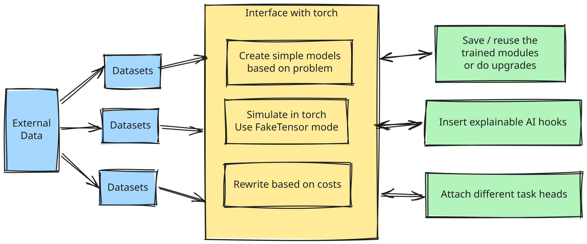

```
       _____
______ ___(_)________      _______ _____  __
_  __ `/_  /_  __ \_ | /| / /  __ `/_  / / /
/ /_/ /_  / / /_/ /_ |/ |/ // /_/ /_  /_/ /
\__,_/ /_/  \____/____/|__/ \__,_/ _\__, /
                                   /____/

An optimizing compiler for ML algorithms.
```

# 🛣️ AioWay

> Aioway is an optimizing compiler for deep learning algorithms.
> It treats the machine learning models / algorithms as instructions and build the pipeline that way.

### 🏢 Architecture diagram



### 🍰 Features

> Most of these features are done but not polished yet! But will be in couple of weeks.

- ⚡ Fast. Compared to neural architecture search, the optimization can be rule based (fast).
- 🕵️ Detects the tasks at hand, resource available, and select the best algorithms and models.
- 🎁 The models built from aioway would be white box (explainable), due to our architecture.
- ⚙️ Allows upgrading parts of the models. You scale up to different model size, and to different machines.
- 🐍 Both relational algebra (SQL like) and python library interface.
- 🔥 Extensible with custom pytorch.

### ⛰️ Compared with current landscape

1. Neural architecture search: Too slow (because most need backtracking).
2. Current autoML framework: non flexible enough, usually stuck with UI or fixed set of models (black box still).
3. Pretrained models / LLM: Usually expensive, non explainable, less flexible.
4. Traditional methods: They can't handle new data (multimodal).


### 🤔 Why aioway yada yada

In the recent years, machine learning's entry barrier higher, rather than lower. People with expert training are expensive, as they need years of experience to be good.

However, current AutoML solutions are subpar. Each one of them have clear limitations: slow, inflexible, unreliable, or unable to handle modern data.

Drawing inspriation from opitmizing compilers (especially SQLs), `aioway` aims to solve that.


## [🌟 Give us a star][star]!

That's all for now!

If you have read this far, please consider giving me a [star (⭐)][star] or a fork (🍴).

This will keep me motivated!

Or if you have too much cash at hand: [](https://www.buymeacoffee.com/rentruewang)

### 🗺️ Roadmap

We are most likely launching `v0.1.0` before July 2026, but before that,
see the pre-release tracking [project](https://github.com/users/rentruewang/projects/7) for more details.

## 🤝 Contributing

Contributing is of course welcome. Please see the [contributing guide](./CONTRIBUTING.md) and follow the [code of conduct](./CODE_OF_CONDUCT.md).

## 👨‍👨‍👦‍👦 Contributors

<a href="https://github.com/rentruewang/aioway/graphs/contributors">
  
</a>


## 🐨 Relation to koila

Aioway builds on top of the original [`koila` (moved to a branch)][koila]. The `torch` team built `FakeTensor` which overlaps a lot with `koila`'s functionality, so it's no longer maintained. See the rationale in the [koila][koila] branch.

Conceptually, `aioway` works in a similar way, but instead of `Tensor` ops, `aioway` focuses on a higher level, on **algorithm building**.


[koila]: https://github.com/rentruewang/aioway/tree/koila
[star]: https://github.com/rentruewang/aioway/stargazers
